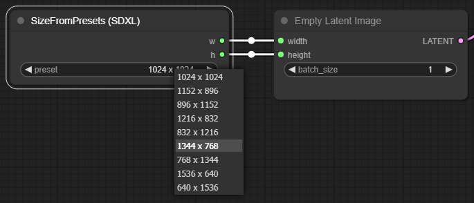

# ComfyUI-SizeFromPresets

- [ComfyUI](https://github.com/comfyanonymous/ComfyUI)用のカスタムノードです。
- プリセットから選択したサイズの幅と高さを出力するノードを追加します。

## 追加されるノード
### SizeFromPresets (SD1.5)
- SD1.5用の画像サイズのプリセットを選択できます。
- 選択したサイズの幅と高さを出力します。
- プリセットは [presets/sd15.csv](presets/sd15.csv) から設定できます。

### SizeFromPresets (SDXL)
- SDXL用の画像サイズのプリセットを選択できます。
- 選択したサイズの幅と高さを出力します。
- プリセットは [presets/sdxl.csv](presets/sdxl.csv) から設定できます。